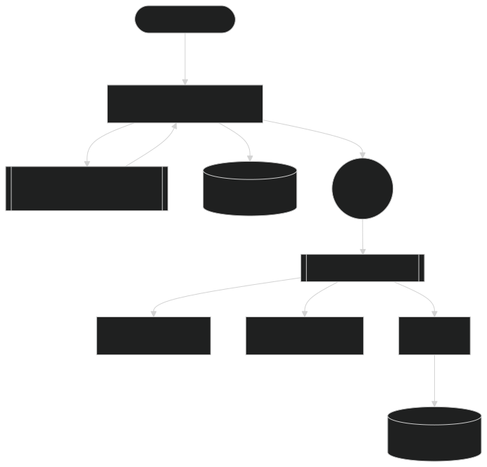

# Payments App

[](https://github.com/lhsazevedo/payments/actions/workflows/ci-payments.yml)
[](https://github.com/lhsazevedo/payments/actions/workflows/ci-users.yml)
[](https://github.com/lhsazevedo/payments/actions/workflows/ci-notification.yml)

Serviço de pagamentos simplificado de alta performance, usando PHP, Swoole e
Nano, PostgreSQL e RabbitMQ.

## Introdução
Esta API de pagamentos prioriza taxa de requisições e baixa latência, aproveitando o processamento concorrente do Swoole. O projeto é composto por dois microsserviços:
- Payments: expõe o endpoint de transferência e lida com autorizações e persistência.
- Notification Worker: consome mensagens da fila RabbitMQ ~~e envia notificações via gateway externo~~.

Essa separação isola falhas de notificações e garante que picos ou quedas nos serviços de SMS/e‑mail não degradem o processamento de pagamentos.

_Nota: No momento, o serviço de notificações não está totalmente implementado._



## Características
- Camada de domínio desacoplada do framework.
- Arquitetura simplificada para o contexto de microserviços.
- Resolução de dependências pelo container de serviços.
- Locking pessimista para evitar double spending.
- Transações com rollback automático em caso de falha.
- Controle de qualidade do código com PHP-CS-Fixer, PHPMD e PHPStan no nível 9.
- Testes unitários com cobertura das regras de negócio.
- Ambiente de desenvolvimento local baseado em Docker e Dev Containers.
- Timestamps armazenadas com milissegundos para precisão de logs e auditoria.

## Funcionalidades Implementadas
- **Transferência de valores entre usuários**
  - Validação de saldo
  - Chamada ao autorizador externo
  - Atualização de saldos em uma transação
- **Mock de Notification Worker**
  - Consome eventos da fila
  - ~~Invoca o endpoint de notificação~~

## Próximos passos
Ideias que tenho para os próximos passos.

- [ ] Implementar serviço de notificações.
- [ ] Revisitar modos de falha e implementar soluções como retry e backoff.
- [ ] Escrever testes de integração.
- [ ] Criar script de configuração do RabbitMQ.
- [ ] Adicionar métodos ausentes nos repositórios.
- [ ] Implementar métodos aritméticos no Value Object `Amount()`.
- [ ] Implementar hidratação de entidades usando Reflection
- [ ] Permitir controle do endereço do serviço autorizador de pagamentos usando variáveis de ambiente.
- [ ] Registrar pagamentos não autorizados.
- [ ] Considerar separar usuários e contas em entidades diferentes.

## Configuração

**1. Clonar e rodar**  
Após clonar o repositório, suba os serviços usando:
```bash
docker compose up
```

**2. Executar migrations e seeders**  
Abra um novo terminal e execute o seguinte comando para criar o schema no BD e populá-lo com alguns usuários:
```bash
docker compose run payments php payments-server.php migrate --seed
```
Se você obtiver a saída abaixo, nosso banco de dados já estará preparado.
```
[INFO] Migration table created successfully.
Migrating: 2025_04_16_200006_create_users_table
Migrated:  2025_04_16_200006_create_users_table
Migrating: 2025_04_16_200233_create_payments_table
Migrated:  2025_04_16_200233_create_payments_table
Seed: UserSeeder
Seeded: UserSeeder
```

_Nota:_ Se tiver problemas para executar as migrações, experimente fazer um drop das tabelas do banco manualmente primeiro.

**3. Fazer uma requisição e acompanhar os serviços**  
Agora que ambas as aplicações já estão rodando, podemos fazer uma requisição para o endpoint `POST /transfer` usando o `curl`.

O serviço de notificações ainda não está devidamente implementado, mas podemos vê-lo consumindo as mensagens da fila do RabbitMQ. Para isso, recomendo abrir um log exclusivo deste app:

```bash
docker compose logs -f notification
```

Em seguida, em um novo terminal, podemos testar fazendo a requisição:

```bash
curl -X POST \
    -H "Content-Type: application/json" \
    --data '{"payer_id": 1, "payee_id": 2, "amount": 1000}' \
    0.0.0.0:9501/transfer
```

Dependendo da resposta do serviço autorizador, você obterá uma das duas
respostas abaixo:
```
{
  "status": "success",
  "data": {
    "message": "Transferred successfully"
  }
}
```
```
{
  "status": "fail",
  "data": {
    "message": "Transfer was not authorized by external service"
  }
}
```

Além disso, nos logs do serviço autorizador, você verá os dumps das mensagens
consumidas:

```
array(2) {
  'mobile_number' =>
  string(11) "21912345678"
  'message' =>
  string(42) "Olá, Bob! Você recebeu R$ 1,30 de Alice."
}
/app/notification/notification-server.php:25:
array(2) {
  'email' =>
  string(18) "bob@exemplo.com.br"
  'contents' =>
  string(51) "<h1>Olá, Bob! Você recebeu R$ 1,30 de Alice.</h1>"
}
```

Experimente trocar os valores no payload JSON para explorar as respostas da API.
Para experimentar com um lojista, você pode usar o usuário com ID 3.

_Nota:_ Para formatar a saída JSON do curl, você pode usar a ferramenta `jq`.
